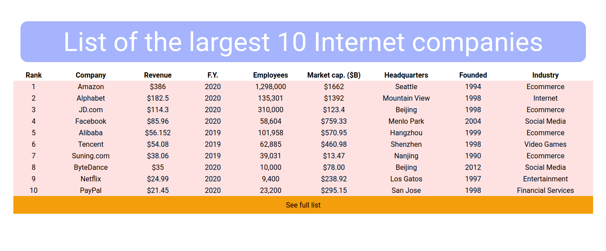

# Covid Tracker

### Scraps data of Top largest companies from a wikipedia and displays them in a table

<hr>

## Demo

<table>
  <tr>
    <td>Largest Tech companies</td>
  </tr>
  <tr>
    <td></td>
  </tr>

 </table>
<br/><hr><br/>

## Stacks

- Python
- Flask
- BeautifulSoup
- requests
- Tailwind CSS

<br/><hr><br/>

## Features

```
1. Scraps and extracts able data from wikipedia
2. Display info in template
```
